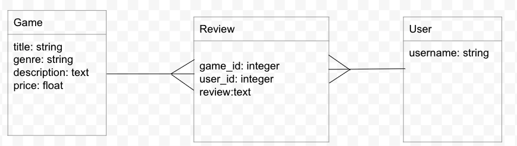
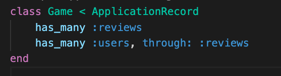
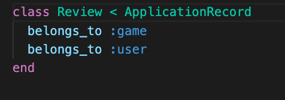
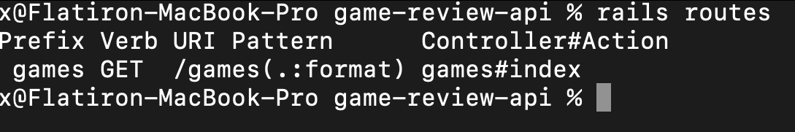
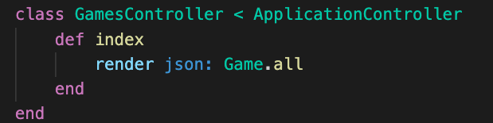

# Deliverables
Create a rails app 

>Note: if you get stuck review Intro to Rails, Creating a Rails APP, and Rails and Active Record 

You've been hired to create a Game Review app. It will have a React client and Rails api. 

Start with building out the Backend.

1. Create a rails app named game_reviews. Add the following flags: --api --minimal --skip-javascript -T
 

      

        solution 
      

      

        rails new game-review-api --api --minimal --skip-javascript -T
      

 

2. `cd` into game-review-api Use resources to generate Games Users and Reviews 

 

      

        solution 
      

      

        rails g resource game title genre description:text price:float
         
        rails g resource user username 
         
        rails g resource review game:belongs_to user:belongs_to review:text
      

 

3. Review your migrations and migrate

 

      

        solution 
      

      

      
      

 

 4. Add your associations and create seeds. After, verify  your seeds and associations in your rails console 
 
 

      

        solution 
      

      

      
        
        
        
      

 

 5. Restrict your routes to the game index route. View your rotes with `rails routes` in the console. 

 

      

        solution 
      

      

      
        
      

 

 6. In your Game controller add an index action and render all of your game data.
 Run your server with `rails s` and confirm the data is being sent to localhost:3000/games

  

      

        solution 
      

      

      
      

 

 Bonus
 7. Create a show route that includes the games associated review data