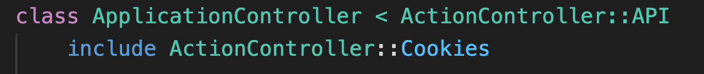
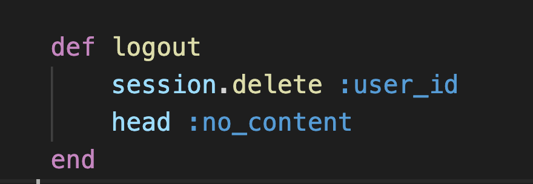

# Deliverables
Create a rails app 

Add Cookies and sessions to your app
1. Add the following middleware to `config/application.rb`   
    config.middleware.use ActionDispatch::Cookies  
    config.middleware.use ActionDispatch::Session::CookieStore   
    config.action_dispatch.cookies_same_site_protection = :strict   
 

      

        solution 
      

      

      
      

 

2. Include cookies in your controller.

 

      

        solution 
      

      

      
      

 

3. Create a custom login route that points to a login action. In the session controller create a login method that authenticates a user and sets their `user_id` to sessions when they login. 

   

      

        solution 
      

      

      
      

 

 4. Create a custom logout route that removes the user_id from sessions. 

   

      

        solution 
      

      

      
      

 

 Bonus 
 5. Add an action that verifies if there is a user in sessions in the ApplicationController. Run that action before all other actions excluding login and signup. 