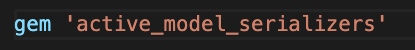
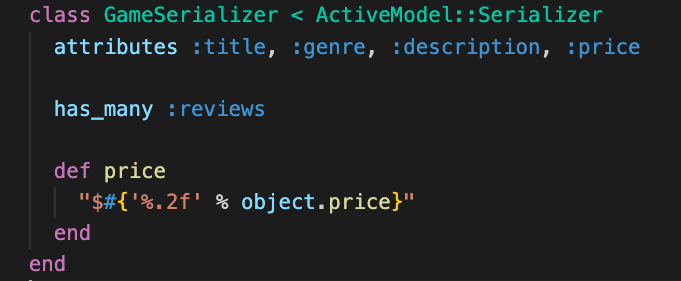

# Deliverables
Create a rails app 

>Note: if you get stuck review Active Model Serializer

You've been hired to create a Game Review app. It will have a React client and Rails api. 

1. Add Active Model Serializer to the gemfile and bundle.
 

      

        solution 
      

      

         
      

 

2. Generate a serializer for every model.

 

      

        solution 
      

      

      rails g serializer game
       
      rails g serializer review
         
      rails g serializer user
      

 

3. Customize each serializer.
  - Add specific attributes, exclude things like id  created_at.
  - Add at least one customized attribute, for example format price to have a $ and two decimal points 
  - Add an association, use has_many or belongs_to to add one of the associated values. 
  - Test your serializer with the browser or postman. If you haven't already done so, add the index/show action to the controller of the model your testing.

   

      

        solution 
      

      

      
      

 
