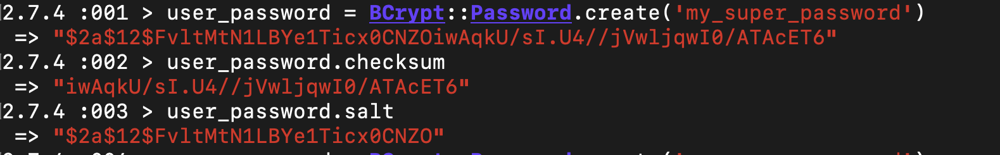
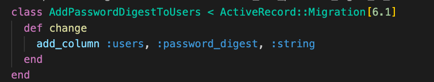
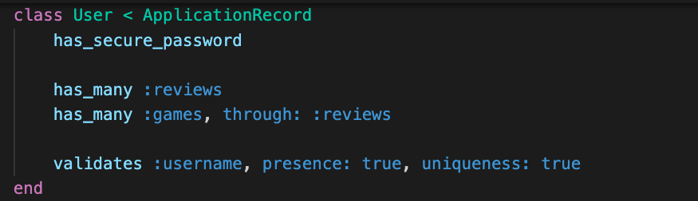

# Deliverables
Create a rails app 

>Note: if you get stuck review Password Protection

You've been hired to create a Game Review app. It will have a React client and Rails api. 

1. Add BCrypt to your gem file and bundle.
 

      

        solution 
      

      

        gem 'bcrypt', '~> 3.1.7'
      

 

2. Take a moment to play with BCrypt in the console to gain an understanding of what it's doing for us. 

 

      

        solution 
      

      

      
      

 

3. Add a password_digest column to user.

   

      

        solution 
      

      

      
      

 

 4. Add has_secure_password to users and add the password param to the users strong params in the users controller. Why is this password instead of password_digest? Test your user create route to prove your hashing is working.

   

      

        solution 
      

      

      
      

 
