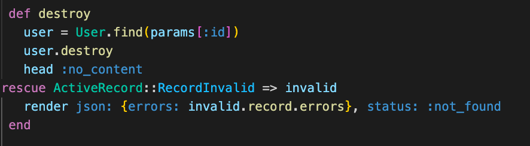
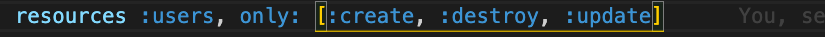

# Deliverables
Create a rails app 

>Note: if you get stuck review Rails Resource Routing: Update and Rails Resource Routing: Destroy

You've been hired to create a Game Review app. It will have a React client and Rails api. 

1. Using the model and controller you worked on yesterday build out the destroy action. The destroy action should return a 204 :no_content and should handle :not_found errors. Test out your route with postman.
 

      

        solution 
      

      

         
      

       
      

 

2. Build out the update action. The update action should use strong params, return the updated resource and handel errors. Test out your route with postman.

 

      

        solution 
      

      

      
        
      

 

Bonus
3. Build out the rest of CRUD for the remaining controllers